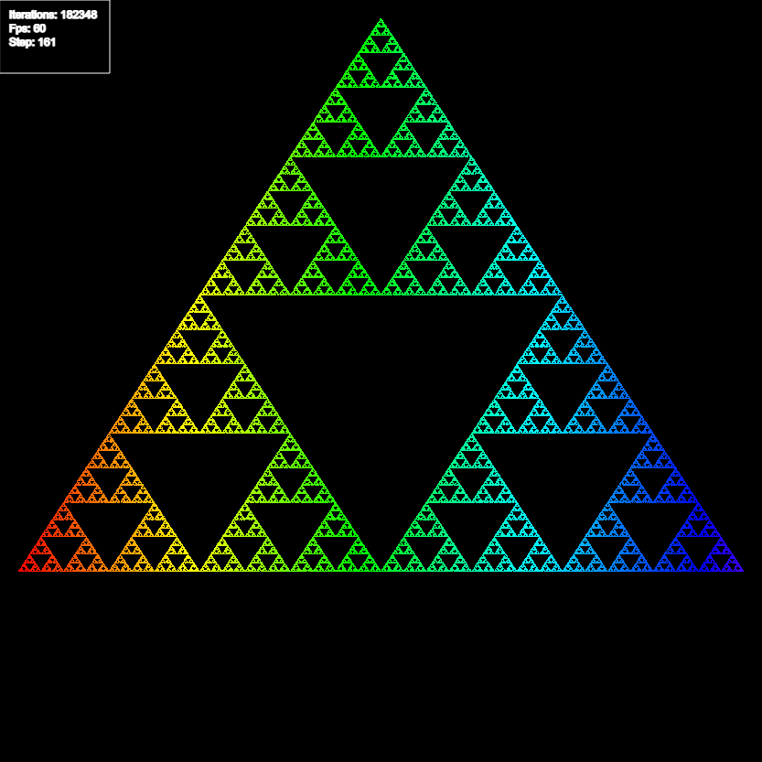
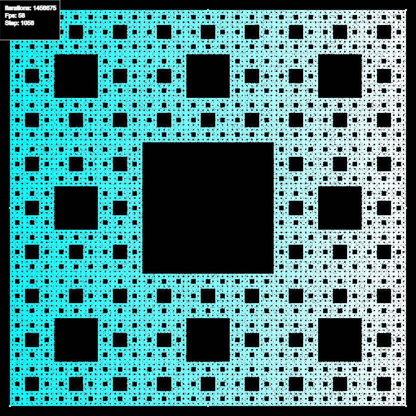

# Chaos-Game
Fractals made using chaos game methods

Chaos game relies on simple rules to create advanced fractals, for instance:

The triangle (or also known as the Sierpinski triangle) is made by picking one of 3 points on a triangle and drawing a point at the midpoint between the selected location and the previous location, for the first iteration another triangle point can be picked

## [triangle](https://editor.p5js.org/gclebor-16/sketches/4DbRWaMDU)

## [Square](https://editor.p5js.org/gclebor-16/sketches/SD42Flunq)

